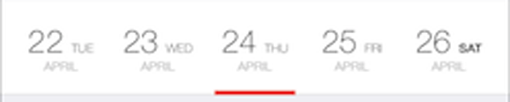
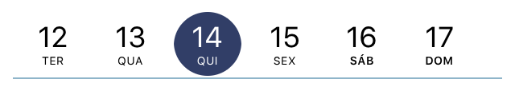

DIDatepicker
============

Original, with a single line and overflowing weekdays:

Updated, with Sunrise style calendar and simpler titles:

Rewritten, working for iOS 9. Sample usage is available in the `DIViewController`.

## Requirements

`DIDatepicker` uses ARC and requires iOS 7.0+. Works for iPhone and iPad.

## Installation

### Manual

Copy the folder `Sources/` to your project.

##License

Copyright (c) 2016 InEvent

Original code [https://github.com/noxt/DIDatepicker](https://github.com/noxt/DIDatepicker).